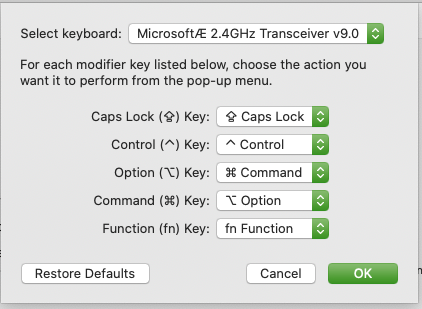

# Menu

1. [Pimp My Vim](https://github.com/omersi/pimp_my_laptop#pimp-my-vim)
1. [Pimp My ZSH](https://github.com/omersi/pimp_my_laptop#pimp-my-zsh)
1. [Mac Modifier Keys](https://github.com/omersi/pimp_my_laptop#mac-modifier-keys)
1. [IDE extensions](https://github.com/omersi/pimp_my_laptop#IDE-extensions)
1. [Kubernetes](https://github.com/omersi/pimp_my_laptop#Kubernetes
)

## pimp_my_vim_zsh

----

### Pimp my Vim

* [ale](https://github.com/w0rp/ale) Asynchronous linting/fixing for Vim
* [dracula-theme](https://github.com/dracula/vim) A dark theme for Vim
* [fzf-vim](https://github.com/junegunn/fzf.vim) Things you can do with fzf and Vim NOTE: Requires** [fzf
* [neocomplete.vim](https://github.com/Shougo/neocomplete.vim) Next generation completion framework after neocomplcache
* [nerdtree](https://github.com/scrooloose/nerdtree) A tree explorer plugin for vim
* [the_silver_searcher](https://github.com/rking/ag.vim) Vim plugin for the_silver_searcher, 'ag' NOTE: Requires the_silver_searcher
* [undotree](https://github.com/mbbill/undotree) The ultimate undo history visualizer
* [vim-airline](https://github.com/vim-airline/vim-airline) lean & mean status/tabline for vim
* [vim-commentary](https://github.com/tpope/vim-commentary) comment stuff out easy peasy
* [vim-fugitive](https://github.com/tpope/vim-fugitive) A Git wrapper so awesome
* [vim-gitgutter](https://github.com/airblade/vim-gitgutter) A Vim plugin which shows a git diff in the gutter (sign column) and stages/undoes hunks.
* [vim-go](https://github.com/fatih/vim-go) Go development plugin for Vim
* [vim-multiple-cursors](https://github.com/terryma/vim-multiple-cursors) True Sublime Text style multiple selections for Vim
* [vim-surround](https://github.com/tpope/vim-surround) Quoting/parenthesizing made simple
* [vim-terraform](https://github.com/hashivim/vim-terraform) Basic vim/terraform integration
* [vim-tmux-navigator](https://github.com/christoomey/vim-tmux-navigator) Seamless navigation between tmux panes and vim splits
* [vim-yapf](https://github.com/mindriot101/vim-yapf) Python linter NOTE: Requires yapf
* [shellcheck](https://github.com/koalaman/shellcheck) ShellCheck, a static analysis tool for shell scripts

----

### Pimp my zsh

### iTerm Move cursor with ctrl + arrow keys

Set it to work using option (⌥) + arrows

```bash
bindkey "\e\e[D" backward-word
bindkey "\e\e[C" forward-word
```

### Prefered Theme

* [Amuse](https://github.com/robbyrussell/oh-my-zsh/wiki/Themes#amuse)


### Plugins

* <https://www.freecodecamp.org/news/jazz-up-your-zsh-terminal-in-seven-steps-a-visual-guide-e81a8fd59a38/>
* [zsh](https://ohmyz.sh/) Your terminal never felt this good before
* [oh-my-zsh](https://github.com/robbyrussell/oh-my-zsh) Framework for managing your zsh configuration
* [zsh-completions](https://github.com/zsh-users/zsh-completions) [Additional completion definitions for Zsh)
* [zsh-syntax-highlighting](https://github.com/zsh-users/zsh-syntax-highlighting) Fish shell like syntax highlighting for Zsh.
* [bat](https://github.com/sharkdp/bat) A cat(1) clone with wings
* [Automaticaly switch to Vevn](https://github.com/MichaelAquilina/zsh-autoswitch-virtualenv)

### Aliases

```bash
alias lql='ls -lA *sql'
alias hg='history | grep'
alias pd='$HOME/workspace/scripts/pd.sh'
alias cat='bat'
#alias python='python3'
alias ipython='ipython3'
alias ptp='ptpython3'
alias stree='tree -I \'igore1|ignore2|ignore3_*\''
```

----

### FZF

```bash
### fzf ############################
[ -f ~/.fzf.zsh ] && source ~/.fzf.zsh
export FZF_DEFAULT_OPTS='-m --color fg:-1,bg:-1,hl:120,fg+:3,bg+:233,hl+:229 --color info:140,prompt:120,spinner:150,pointer:167,marker:174'
 # fe - Open the selected files with the default editor
fe() {
   local files=$(fzf --query="$1" --select-1 --exit-0 | sed -e "s/\(.*\)/\'\1\'/")
   local command="${EDITOR:-vim} -p $files"
   [ -n "$files" ] && eval $command
}
 # fag - find an argument with ag and fzf and open with vim
fag() {
 [ $# -eq 0  ] && return
 local out cols
 if out=$(ag --nogroup --color "$@" | fzf --ansi); then
   setopt sh_word_split
   cols=(${out//:/  })
   unsetopt sh_word_split
   vim ${cols[1]} +"normal! ${cols[2]}zz"
 fi
}
 # cdf - cd into the directory of the selected file\
cdf() {
  local file
  local dir
  file=$(fzf +m -q "$1") && dir=$(dirname "$file") && cd "$dir"
}
 fep() {
    local files=$(fzf --query="$1" --select-1 --exit-0 --preview="bat --color=always {}" --preview-window=right:50%:wrap | sed -e "s/\(.*\)/\'\1\'/")
    local command="${EDITOR:-vim} -p $files"
    [ -n "$files" ] && eval $command
}
#####################################
```

## Other Stuff

* Change your PS1 [BashRC Generator](http://bashrcgenerator.com)
* Configure crontab schedule [Crontab Guru](https://crontab.guru)

----

### pd.sh

```bash
#!/bin/bash
export LC_ALL=C
head /dev/urandom | tr -dc 'A-Za-z0-9"#$%&'\''()*+,-./:;<=>?@[\]^_`{|}~' | head -c 30 ; echo ''
```

----

## Mac Modifier Keys

When using mac with external keyboard, it's best to modify the keys to comply with Mac layout.
I set this way:

* Caps Lock > Caps Lock
* Control > Control
* Option > Command
* Command > Option
* Function > fn \(function)

Make sure to select the correct keyboard on the upper drop down menu.



----

## IDE extensions

* [Tabnine](https://www.tabnine.com/welcome/) - TabNine uses deep learning to help you write code faster.

----

## Kubernetes

* K3s - Lightweight Kubernetes <https://k3s.io>
* K9s -  [Kubernetes CLI To Manage Your Clusters In Style](https://github.com/derailed/k9s)
